# Milestone Project 2 - Space is Fun - by Matt Green

My second project was to create an Interactive Front-End website.  

I have chosen to design a website for young explorers, which displays information about space through pop-ups, games, animations and interactive maps.

 _**You can access the completed website by [clicking here](https://mattgreen91.github.io/milestone-project-2/index.html) :rocket:**_

The website was created using HTML5, CSS, Javascript, JQuery, JSON and external APIs and Libraries.

The website has been designed and tested to be fully functional on all devices, including a drop-down mobile navigation menu for smaller devices.

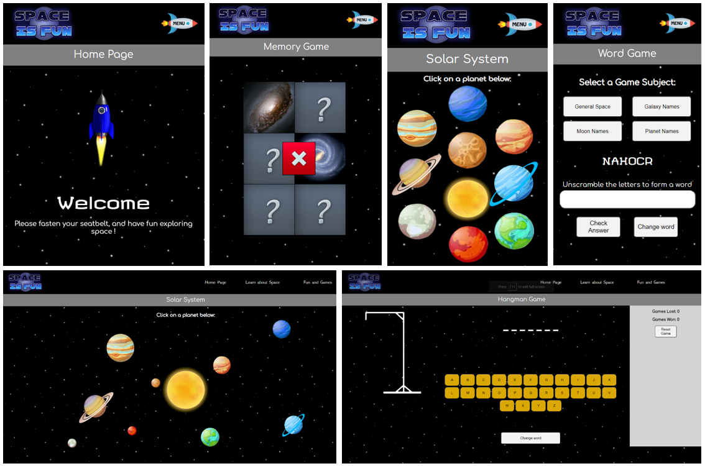
 
## Contents Page

* [1. UX - User Experience](#1-ux---user-experience)
* [2. Features](#2-features)
* [3. Technologies Used](#3-technologies-used)
* [4. Testing](#4-testing)
* [5. Deployment](#5-deployment)
* [6. Credits](#6-credits)

## 1. UX - User Experience 
 
The Website is predominantly designed for teenagers who are learning for education, but it can be used by anyone with an interest in space.  

The user is able to learn key facts about all of the planets in our solar system.  

The user is able to play fun games to learn pictures and names of planets and galaxies, and learn the names of some of the moons in our solar system.  

The user can also view an interactive map which displays the live coordinates of the International Space Satellite plotted onto the map.  

There is also animations and hover effects to make the page more fun. 

**User Stories**

- As a user, I want the website layout to be clear and concise.
- As a user, I want the colours to be appealing but also easy on the eye.
- As a user, I want the navigation to be easy to use, and for me not to get lost in the website.
- As a user, I want all the links to work correctly.
- As a user, I want the website to be very interactive.
- As a user, I don't want too much text to scroll through.
- As a user, I want all the information to be easy to find.
- As a user, I want all the images to be clear, not pixelised.
- As a user, I want the map and games to be fun and work correctly.
- As a user, I want the content to adjust automatically when using multiple screen sizes and devices.
- As a user, I want some animation so the page is appealing.

**Design**

This project was designed with Balsamiq Wireframes, which can be seen below:

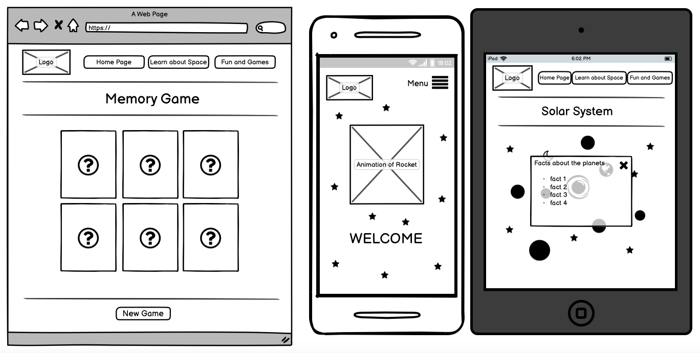

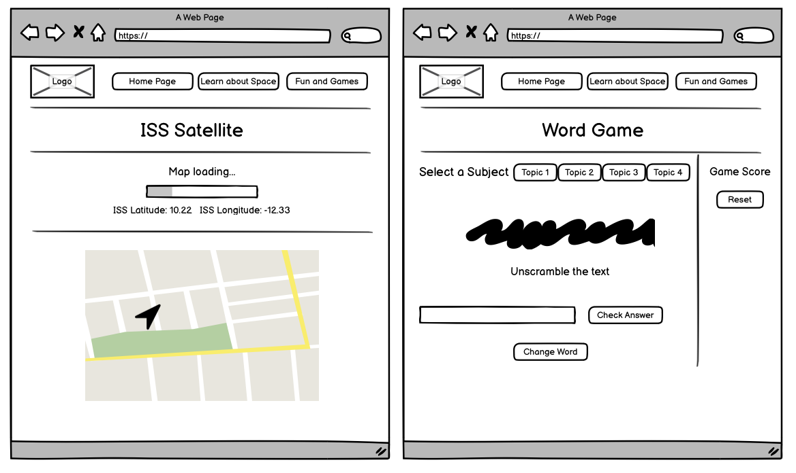

At first I created the basic layout by making a boilerplate, that you can find [here](assets/boilerplate/boilerplate.html).

Although my project only required me to use either Vanilla Javascript, JQuery, JSON, APIs or plug-ins, I decided that I wanted to use all of these in my project to demonstrate the skills that I have learnt.

The planet page was made using excel. assets/readme-files/planet_grid.xlsx

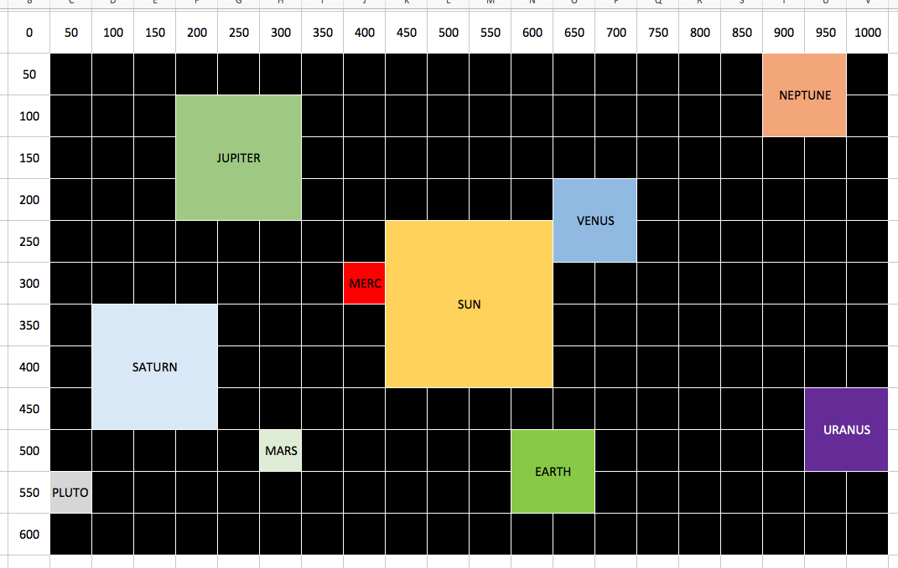

 

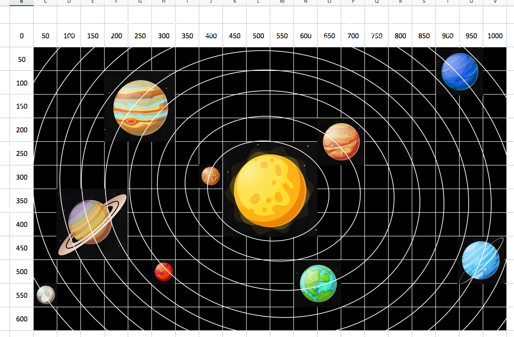

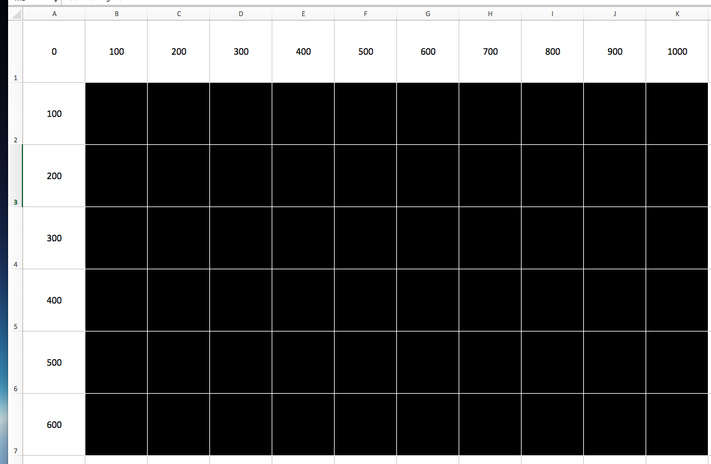

**Accessibility**

The project has many features such as:

* Fall-back fonts, in case Google Fonts are not compatible with the browser
* Alternate Text' attributes for images, in case the images do not display
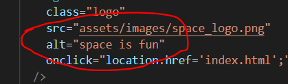
* Banner displays at the top of the screen when Javascript disabled in browser, prompting user to enable

* @media Queries, to modify content to fit different sized screens
* 'ARIA Hidden' attributes (Accessible Rich Internet Applications), and 'ARIA Label' attributes to make it easier for Screen Readers
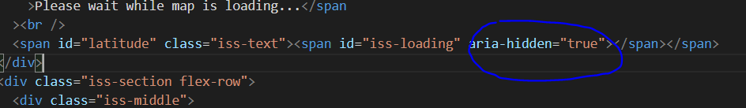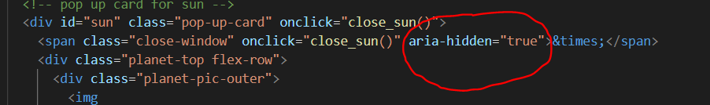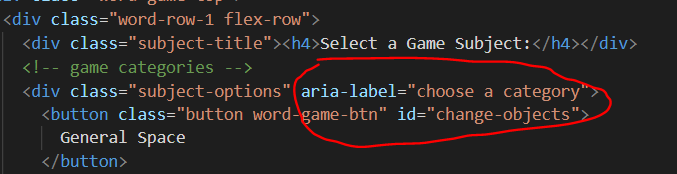
Also, I downloaded 'Screen Reader' extension for Google Chrome which can be found [here](https://chrome.google.com/webstore/detail/screen-reader/kgejglhpjiefppelpmljglcjbhoiplfn?hl=en)
I used this for testing the screen reader, so I know if I need to put aria-hidden where not relevent, and aria-labels where needing to read to the user.
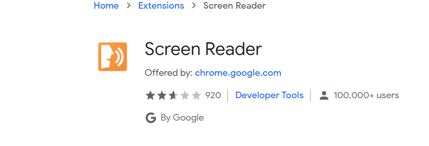

## 2. Features

The main features of this project are:
 
### Existing Features
- Simplistic Colour Design (black/white/grey) - allows users to see and process information more easily, as the colours are much more appealing to the eye.
- Stylish Font Theme - allows users to feel more engaged by matching similar fonts to space theme.
- Navigation Menu - allows users switch between pages . Hover animations to add style.
- Mobile Navigation Menu - allows users to save screen space on Mobile Devices by using an animated dropdown menu, stylish by using a rocket logo instead, so users can see more content.
- Embedded Google Maps.
- Responsive Games
- Animations

### Features Left to Implement
- The memory game needs configuring to work more cards on larger screen, as the number of cards is set inside the script tag, this was not done.

As you can see, the column count is set in the script tag.  This is a library plugin, so the code is already created. When I tried to make multiple scripts for different screen sizes it was causing issues, as the script only loads once.
Therefore, I have only set it up for 2 columns, which will cover smaller device sizes.  But to improve performance, it would be better to have more columns for larger screens.
- 

## 3. Technologies Used

In order to construct this project, the below technologies were used: 

- [HTML5](https://html.spec.whatwg.org)
    - The project uses **HTML5** to create the basic structure, text, images and other elements.
- [CSS3](https://www.w3.org/Style/CSS/specs.en.html)
    - The project uses **CSS3** to add customised style to the webpage.
- [Bootstrap 4 Framework](https://getbootstrap.com/docs/4.0/getting-started/introduction)
    - The project uses **Bootstrap 4 Framework** to simplify the layout using Grid System, and customise style with other built-in features.
- [CDN Libraries](https://cdnjs.com/libraries)
    - The project uses **CDN Libraries** which are part of bootstrap, to create the Mobile Navigation Menu, and Photo Carousel.
- [GitPod IDE](https://gitpod.io)
    - The project uses **GitPod IDE** to design, commit and push code into the repository.
- [Pixelmator](https://www.pixelmator.com/pro)
    - The project uses **Pixelmator** to crop and modify image dimensions, to maintain consistency.
- [Font Awesome](https://fontawesome.com/)
    - The project uses **Font Awesome** to add pre-set icons to navigation menu, social links, and form button.
- [Google Fonts](https://fonts.google.com/)
    - The project uses **Google Fonts** to add customised font styles to the webpage.
- [Balsamiq WireFrames](https://balsamiq.com/wireframes/desktop)
    - The project uses **Balsamiq WireFrames** to generate a digital prototype of the webpage before coding.
- [Responsive Viewer Extension - Chrome](https://chrome.google.com/webstore/detail/responsive-viewer/inmopeiepgfljkpkidclfgbgbmfcennb?hl=en)
    - The project uses **Responsive Viewer Extension - Chrome** to easily test the webpage on multiple sized devices at once.
- [HTML5 Validator](https://validator.w3.org)
    - The project uses **HTML5 Validator** to check all the HTML5 code is working, without any errors.
- [CSS3 Validator](https://jigsaw.w3.org/css-validator)
    - The project uses **Responsive Viewer Extension - Chrome** to check all the CSS3 code is working, without any errors.

## 4. Testing

This website has been fully tested and is working correctly.  There were some bugs that I had overcome, which you can see by [clicking here](assets/readme-files/issues-experienced.pdf).

I used the Google Chrome and Mozilla FireFox developer tools to tweak code when testing.

The HTML5 Code was put through the official validator, which currently has no errors.

The CSS3 Code was put through the official validator, which currently has no errors.

Main Areas of Testing:

Bugs

## 5. Deployment

This project was created using GitPod IDE which was recommended by Code Institute.  The reason for choosing this IDE is because it is all online, so no additional software needs to be installed, and the project can be accessed and edited on any workstation, as long as internet is available.

Code Institute had provided an Initial Template which included all the relevent extensions to aid with my project. The template can be accessed by [clicking here](https://github.com/Code-Institute-Org/gitpod-full-template).

For ease, I downloaded the GitPod [Google Chrome extension](https://chrome.google.com/webstore/detail/gitpod-dev-environments-i/dodmmooeoklaejobgleioelladacbeki?hl=en) and [Mozilla Firefox extension](https://addons.mozilla.org/en-GB/firefox/addon/gitpod/).  By doing this, a green Gitpod button appears on the project's GitHub page - linking the project directly to the workspace.

The CLI (Command Line Interface) is built into GitPod, which means no additional software needs to be downloaded.

The process for adding/modifying/removing content is as per below:

`git add "file-name-1.ext"` _to add the first new/modified file to the staging area_

`git add "file-name-2.ext"` _to add the second new/modified file to the staging area_

Once all files have been added/updated then...

`git commit -m "commit message goes here"` _the commit message needs to be entered inside the inverted commmas " "_

`git push` _this commmand push the content into the GitHub repository_

When there are multiple files, it can take a long time to add all modifications, so instead I used a shortcut:

`git status`  _to view all status changes_

`all modifications will now be listed here on the CLI`

`git add .`  _the . means 'all above', so this command will update all changes_

`git commit -m "commit message goes here"`  _commit message needs to be entered inside the inverted commas " "_

`git push`  _this commmand push the content into the GitHub repository_

Code Institute also provided a [Readme Template](https://github.com/Code-Institute-Solutions/readme-template) which I used as a guideline for creating this Readme file.

The project can be opened by [clicking here](https://mattgreen91.github.io/milestone-project-1/index.html)

## 6. Credits

### Content
- The information about Ed Sheeran was sourced from the website [The Famous People](https://www.thefamouspeople.com/profiles/ed-sheeran-29882.php).
- All social links go to his official social media accounts.
- Mobile Navigation Menu was made with the help of [MD BootStrap](https://mdbootstrap.com/docs/standard/navigation/navbar).
- Hiding Divs was done with the help of [BootStrap](https://getbootstrap.com/docs/4.0/utilities/display).
- Flex displaying was done with the help of [Coder Coder](https://coder-coder.com/how-to-center-button-with-html-css).

### Media
- Where all media was sourced

### Acknowledgements

- Thanks to Code Institute for training me on HTML5, CSS, Javascript, JQuery, JSON and APIs
- Thanks to my mentor Allen Thomas Varghese for supporting me.
- Thanks to Slack Community for helping me solve any issues with code not working.
- Thanks to Code Institute for helping me fix any glitches with the IDE that I came across.

sun https://www.google.com/url?sa=i&url=https%3A%2F%2Fwww.123rf.com%2Fclipart-vector%2Ffireball_sun.html&psig=AOvVaw3PKbUapv104rQ4lDK4zAGE&ust=1617309458016000&source=images&cd=vfe&ved=0CA0QjhxqFwoTCPjXyMmx2-8CFQAAAAAdAAAAABAT

planets https://www.google.com/url?sa=i&url=https%3A%2F%2Fwww.etsy.com%2Fsg-en%2Flisting%2F769524337%2Fsolar-system-print-set-set-of-10-prints&psig=AOvVaw2dvoBL7X7GWB8dicKCH5uy&ust=1617141853175000&source=images&cd=vfe&ved=0CA0QjhxqFwoTCLDj65LB1u8CFQAAAAAdAAAAABAI

facts about planets https://space-facts.com/

starfall animation https://stackoverflow.com/questions/30730650/css-way-of-looping-a-background-image-with-cover-or-contain-sizing

rocket animation pic  https://www.google.com/url?sa=i&url=https%3A%2F%2Fwww.hiclipart.com%2Ffree-transparent-background-png-clipart-ppjor&psig=AOvVaw1Mcjy5UPf-usPiF2sXzppj&ust=1617281650251000&source=images&cd=vfe&ved=0CA0QjhxqFwoTCNji4frJ2u8CFQAAAAAdAAAAABAS

popups https://www.w3schools.com/howto/howto_css_modals.asp

information on moons https://solarsystem.nasa.gov/

information and pics on galaxies https://www.nationalgeographic.com/science/article/galaxies-gallery

iss logo https://icons.iconarchive.com/icons/goodstuff-no-nonsense/free-space/256/international-space-station-icon.png

google maps api  https://developers.google.com/maps/documentation/javascript

memory game plugin http://memorygame.quizyplugin.com/

refresh button http://www.learningaboutelectronics.com/Articles/How-to-create-a-refresh-page-button-using-Javascript.php

dropdown menu https://www.w3schools.com/howto/tryit.asp?filename=tryhow_js_sidenav_dropdown

iss api https://wheretheiss.at/

each game how was made one by one - what format vanilla? json? etc.

also mention about wireframes expiring, and issue with gitpod not saving to github after push... had to save all files after and push manually... commits were showing in github but files not updated...

navigation rocket image  https://www.pngkey.com/detail/u2q8q8a9r5o0u2r5_emojione-1f680-rocket-emoji-png/

to get API key : https://developers.google.com/maps and press get started

error 404 image taken from https://www.vecteezy.com/vector-art/541659-earth-and-moon-space-scene

CSS added into header of 404 page in case issue with CSS file - 404 page does not rely on any other assets except the image.

deployment github pages