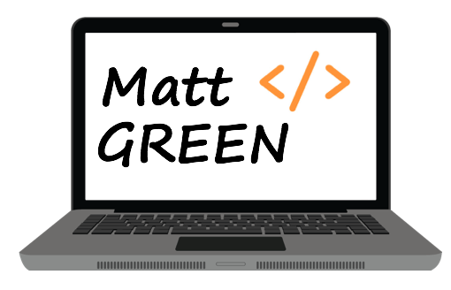
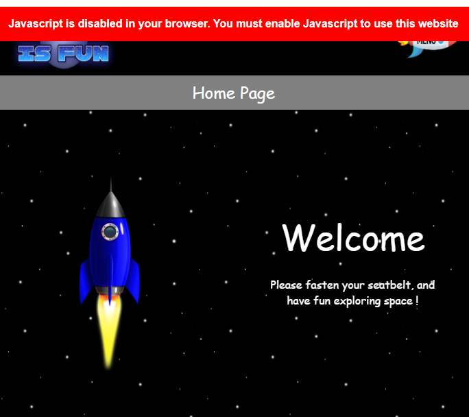
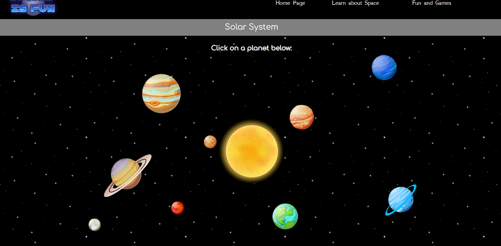

# Milestone Project 2 - Space is Fun - by Matt Green

My second project was to create an Interactive Front-End website.  

I have chosen to design a website for young explorers, which displays information about space through pop-ups, games, animations and interactive maps.

 _**You can access the completed website by [clicking here](https://mattgreen91.github.io/milestone-project-2/index.html) :rocket:**_

The website was created using HTML5, CSS, Javascript, JQuery, JSON and external APIs and Libraries.

The website has been designed and tested to be fully functional on all devices, including a drop-down mobile navigation menu for smaller devices.

 
## Contents Page

* [1. UX - User Experience](#1-ux---user-experience)
* [2. Features](#2-features)
* [3. Technologies Used](#3-technologies-used)
* [4. Testing](#4-testing)
* [5. Deployment](#5-deployment)
* [6. Credits](#6-credits)

## 1. UX - User Experience 
 
- The Website is predominantly designed for teenagers who are learning for education, but it can be used by anyone with an interest in space.  
- The user is able to learn key facts about all of the planets in our solar system.  
- The user is able to play fun games to learn pictures and names of planets and galaxies, and learn the names of some of the moons in our solar system.  
- The user can also view an interactive map which displays the live coordinates of the International Space Satellite plotted onto the map.  
- There is also animations and hover effects to make the page more fun. 

**User Stories**

- As a user, I want the website layout to be clear and concise.
- As a user, I want the colours to be appealing but also easy on the eye.
- As a user, I want the navigation to be easy to use, and for me not to get lost in the website.
- As a user, I want all the links to work correctly.
- As a user, I want the website to be very interactive.
- As a user, I don't want too much text to scroll through.
- As a user, I want all the information to be easy to find.
- As a user, I want all the images to be clear, not pixelised.
- As a user, I want the map and games to be fun and work correctly.
- As a user, I want the content to adjust automatically when using multiple screen sizes and devices.
- As a user, I want some animation so the page is appealing.

**Design**

This project was designed with Balsamiq Wireframes, which can be seen below:

Before starting my project, I created a basic Boilerplate, and used this as a template.  You can find it [here](assets/boilerplate/boilerplate.html).

Although my project only required me to use either Vanilla Javascript, JQuery, JSON, APIs or plug-ins, I decided that I wanted to use all of these in my project to demonstrate the skills that I have learnt.

**Accessibility**

The project has many features such as:

* Fall-back fonts, in case Google Fonts are not compatible with the browser
* Alternate Text' attributes for images, in case the images do not display

* Banner displays at the top of the screen when Javascript disabled in browser, prompting user to enable

* @media Queries, to modify content to fit different sized screens
* 'ARIA Hidden' attributes (Accessible Rich Internet Applications), and 'ARIA Label' attributes to make it easier for Screen Readers

* Also, I downloaded 'Screen Reader' extension for Google Chrome which can be found [here](https://chrome.google.com/webstore/detail/screen-reader/kgejglhpjiefppelpmljglcjbhoiplfn?hl=en)
I used this for testing the screen reader, so I know if I need to put aria-hidden where not relevent, and aria-labels where needing to read to the user.
When using with the screen reader, I noted that on the Solar System page, the planet pop-ups did not automatically read, and clicking the text closes the pop-up.  
So I added the 'alert role' to the pop-ups, so when the screen reader sees the pop-up, it will read it automatically

## 2. Features

The main features of this project are:
 
- Simplistic Colour Design (black/white/grey) - allows users to see and process information more easily, as the colours are much more appealing to the eye.
- Stylish Font Theme - allows users to feel more engaged by matching similar fonts to space theme.
- Navigation Menu - allows users switch between pages . Hover animations to add style.
- Mobile Navigation Menu - allows users to save screen space on Mobile Devices by using an animated dropdown menu, stylish by using a rocket logo instead, so users can see more content.
- Embedded Google Maps.
- Responsive Games
- Animations

**Navigation Bar**

The navigation bar was made with the help of [W3 Schools](https://www.w3schools.com/howto/tryit.asp?filename=tryhow_js_sidenav_dropdown).

On smaller screens a mobile navigation menu appears, being a rocket.  The word 'menu' was added to avoid any confusion.  

I have added an effect where the rocket rotates when opened. And all menu items have hover effects.

**Home Page**

The home page was made using animations with CSS.  The rocket appears to be travelling upwards through space.  The skyfall effect was found on [Stack Overflow](https://stackoverflow.com/questions/30730650/css-way-of-looping-a-background-image-with-cover-or-contain-sizing).

**Solar System Page**

The solar system planets on the large screen are aligned as per their orbit. On smaller screens they are equal size and positioned nicely for the screen.  

To achieve a realistic orbit, I created an Excel Spreadsheet of the same pixels as the webpage, which you can see [here](assets/readme-files/planet_grid.xlsx). 

I then positioned the planets, distanced them using orbit rings, and mapped the exact locations onto the webpage.

 

**ISS Satellite Page**

The ISS coordinates are taken from an online JSON file using the [WTIA REST API](https://wheretheiss.at/w/developer).
The coordinates are then plotted onto a map, using [Google Maps API](https://developers.google.com/maps).

 

A loading effect was created using CSS, which disappears once the page has loaded.

 

**Hangman Game Page**

For the Hangman Game I wanted to demonstrate my understanding of pure Javascript code, so I decided to make this game using Vanilla Javascript.  

Each correct letter is revealed, and each incorrect letter the game picture changes.  When the game is over it displays an alert if won or lost.

This game also keeps a score on the side that increments, which can be reset if the user wishes to start again.  

**Memory Game Page**

The memory game was created using a plug-in library.  In the script source, the number of columns could be modified, and the images chosen in the CSS file provided.

Although this game was not my own, I wanted to demonstrate that I can implement and adapt plugins into my project.

While the game does look nice, unfortunately I could not set different column counts for different screen sizes as the script loads only once.

So I had to keep it at 2 columns for all screen sizes, so it can be played on small devices.  Ideally I would have preferred more columns for larger devices.

During the game, the user has to compare 2 cards, and guess the positions.  Once the game is complete, it will display the time and number of clicks to complete.

**Word Game Page**

For the Word Game I wanted to demostrate my skills of using JQuery.  So this full game was made with JQuery only. 

I also decided to use JSON to store the game data.  Inside the JSON file there are 4 categories, and each catergory contains different words.

The user has an option to choose a category when the game begins.  It displays an error if a category is not selected, or if an empty box is submitted.

Like the hangman game, this game also keeps a score, and can be reset if the user wishes.

**Error 404 Page**

In case the user enters a page which does not exist, they will be redirected to an Error 404 page, that has the link to homepage.

In case there is any modifications to the CSS file or location, I have added the CSS to the header of the 404 page instead of linking to the main CSS file.

### Features Left to Implement

- The memory game needs configuring to work more cards on larger screen, as the number of cards is set inside the script tag, this was not done.

As you can see, the column count is set in the script tag.  This is a library plugin, so the code is already created. When I tried to make multiple scripts for different screen sizes it was causing issues, as the script only loads once.
Therefore, I have only set it up for 2 columns, which will cover smaller device sizes.  But to improve performance, it would be better to have more columns for larger screens.

## 3. Technologies Used

In order to construct this project, the below technologies were used: 

- [Gitpod IDE](https://gitpod.io)
    - The project uses **Gitpod IDE** with build in Bash CLI to write and push code to GitHub.
- [HTML5](https://html.spec.whatwg.org)
    - The project uses **HTML5** to create the basic structure, text, images and other elements.
- [CSS3](https://www.w3.org/Style/CSS/specs.en.html)
    - The project uses **CSS3** to add customised style and animations to the webpage.
- [Javascript](https://www.javascript.com)
    - The project uses **Javascript** to add interactivity on all pages.
- [JQuery](https://jquery.com)
    - The project uses **JQuery** as an addition to Javascript to make code simple and concise.
- [JSON](https://www.json.org)
    - The project uses **JSON** to store game data, which is both neatly organised and easy to access.
- [Google Maps API](https://developers.google.com/maps)
    - The project uses **Google Maps API** to display a Google map with a location marker of the ISS satellite coordinates.
- [WTIA REST API](https://wheretheiss.at/w/developer)
    - The project uses **WTIA REST API** to fetch ISS live coordinates from a URL of an updating JSON file.
- [Quizy JQuery Library Plugin](http://memorygame.quizyplugin.com)
    - The project uses **Quizy JQuery Library Plugin** to add further interactivity, by implementing a easily modifyable version of a Memory Game.   
- [Google Fonts](https://fonts.google.com)
    - The project uses **Google Fonts** to add customised font styles to the webpage.
- [Balsamiq WireFrames](https://balsamiq.com/wireframes/desktop)
    - The project uses **Balsamiq WireFrames** to generate a digital prototype of the webpage before coding.
- [Microsoft Excel](https://www.microsoft.com/en-gb/microsoft-365/excel)
    - The project uses **Microsoft Excel** as a guide to position the planets in the correct position on the page.
- [Responsive Viewer Extension - Chrome](https://chrome.google.com/webstore/detail/responsive-viewer/inmopeiepgfljkpkidclfgbgbmfcennb?hl=en)
    - The project uses **Responsive Viewer Extension - Chrome** to easily test the webpage on multiple sized devices at once.
- [Screen Reader Extension - Chrome](https://chrome.google.com/webstore/detail/screen-reader/kgejglhpjiefppelpmljglcjbhoiplfn?hl=en)
    - The project uses **Screen Reader Extension - Chrome** to easily test the accessibility features of the webpage.
- [HTML5 Validator](https://validator.w3.org)
    - The project uses **HTML5 Validator** to check all the HTML5 code is working, without any errors.
- [CSS3 Validator](https://jigsaw.w3.org/css-validator)
    - The project uses **CSS3 Validator** to check all the CSS3 code is working, without any errors.
- [JS Hint](https://jshint.com)
    - The project uses **JS Hint** to test all the Javscript code, and fix any errors.

## 4. Testing

This website has been fully tested and is working correctly.  

I used the Google Chrome and Mozilla FireFox developer tools to tweak code when testing.

**Main Areas of Testing**

I did both manual and automated testing for the website. 
- The manual testing can be opened by clicking [here](assets/readme-files/manual_testing.pdf).
- The automated testing can be opened by clicking [here](assets/readme-files/automated_testing.pdf).

**Bugs Found**

- While testing the accessibility features, the screen reader does not read the individual letters of the scrambled word.
Instead it tries to pronounce the whole scrambled word.  I have therefore added "aria-hidden" attribute to prevent it reading the scrambled word.

- I wanted the Google Map to display the full world map, but on different screen sizes the map's scale kept changing and the satellite was not showing as it was off the map edge.
Therefore I repositioned the map to have the satellite as the centre, instead of being in the centred in the middle of the Earth.

- On smaller screens the close button was not working, so I changed the whole pop-up to close when clicked on.  This stopped the screen reader from reading the text when clicked on.
So I had to add an 'alert role' to the pop-up for the screen reader to read it automatically.

## 5. Deployment

**GitPod**

This project was created using GitPod IDE which was recommended by Code Institute.  The reason for choosing this IDE is because it is all online, so no additional software needs to be installed, and the project can be accessed and edited on any workstation, as long as internet is available.
Code Institute had provided an Initial Template which included all the relevent extensions to aid with my project. The template can be accessed by [clicking here](https://github.com/Code-Institute-Org/gitpod-full-template).
For ease, I downloaded the GitPod [Google Chrome extension](https://chrome.google.com/webstore/detail/gitpod-dev-environments-i/dodmmooeoklaejobgleioelladacbeki?hl=en) and [Mozilla Firefox extension](https://addons.mozilla.org/en-GB/firefox/addon/gitpod/).  By doing this, a green Gitpod button appears on the project's GitHub page - linking the project directly to the workspace.
The CLI (Command Line Interface) is built into GitPod, which means no additional software needs to be downloaded.
The process for adding/modifying/removing content is as per below:

`git add "file-name-1.ext"` _to add the first new/modified file to the staging area_

`git add "file-name-2.ext"` _to add the second new/modified file to the staging area_

Once all files have been added/updated then...

`git commit -m "commit message goes here"` _the commit message needs to be entered inside the inverted commmas " "_

`git push` _this commmand push the content into the GitHub repository_

When there are multiple files, it can take a long time to add all modifications, so instead I used a shortcut:

`git status`  _to view all status changes_

`all modifications will now be listed here on the CLI`

`git add .`  _the . means 'all above', so this command will update all changes_

`git commit -m "commit message goes here"`  _commit message needs to be entered inside the inverted commas " "_

`git push`  _this commmand push the content into the GitHub repository_

**Readme Template**

Code Institute provided a [Readme Template](https://github.com/Code-Institute-Solutions/readme-template) which I used as a guideline for creating this Readme file.

**GitHub Pages**

To publish this page on GitHub, I followed the following steps:
- Log into GitHub and open the repository
- Click on the "Settings" tab on the navigation bar.
- Scroll down to "GitHub Pages", then in the "Source" section, select "master branch" from the dropdown box.
- The URL will then appear, which can be used for accessing the website.

**Cloning Repository**

If you would like to clone this repository locally:
- Download and install [Git](https://git-scm.com/downloads).
- Open Command Prompt (Windows) or Terminal (Mac).
- Type `cd ~/Desktop` and press 'enter' to change the folder to Desktop. (You can choose a different folder, or move the folder manually after completing these steps).
- Type `git clone https://github.com/mattgreen91/milestone-project-2.git`, then press 'enter'.
- Once complete, the repository will be saved on your desktop (or other directory if you changed).
- In order to use this website, you will need to update the Google Maps API Key.
- To get an API key, log into https://developers.google.com and add a payment method (note this service is free)
- Then open https://developers.google.com/maps and press 'get started'.
- Click on 'Go to the project selector page'.

 

- Then from the left pane, choose 'credentials' from the 'APIs and Services' tab.

 

- Then from the top pane, choose 'API key' from the 'Create Credentials' tab.

- Copy the API key, by pressing the copy button on the right.

- Open the page 'iss.html' in your preferred IDE, or text editor.
- At the bottom you will see a script tag which starts with the URL 'https://maps.googleapis.com'.
- The key is saved in the URL between the '=' and '&' symbols.
- Delete the old key, and paste your key that you copied, then save the file.

**Final Project**

The project can be opened by [clicking here](https://mattgreen91.github.io/milestone-project-2/index.html)

## 6. Credits

### Content

- The information about Planets were taken from [Space Facts](https://space-facts.com).
- The information about Moons were taken from [NASA](https://solarsystem.nasa.gov)
- The Dropdown Navigation Menu was made with the help of [W3 Schools](https://www.w3schools.com/howto/tryit.asp?filename=tryhow_js_sidenav_dropdown).
- The Starfall background animation was created some help from [Stack Overflow](https://stackoverflow.com/questions/30730650/css-way-of-looping-a-background-image-with-cover-or-contain-sizing).
- The pop-ups for my planet page were made with the help of [W3 Schools](https://www.w3schools.com/howto/howto_css_modals.asp).
- The map on the ISS Satellite page was created using [Google Maps API](https://developers.google.com/maps/documentation/javascript).
- The ISS Satellite coordinates were fetched from a JSON file using the [WTIA REST API](https://wheretheiss.at/w/developer).
- The Memory Game page was created using a jQuery Libary plugin from [Quizy](http://memorygame.quizyplugin.com).

### Media

- The Sun was taken from [123RF](https://www.123rf.com/clipart-vector/fireball_sun.html?sti=lqa1ccusodz46ltaqv|&).
- The Planets were taken from [Etsy](https://www.etsy.com/sg-en/listing/769524337/solar-system-print-set-set-of-10-prints).
- The Rocket used in the animation on the Home Page was taken from [Hi Clipart](https://www.hiclipart.com/free-transparent-background-png-clipart-ppjor).
- The Rocket used in the Mobile Navigation Bar was taken from [VHV.RS](https://www.vhv.rs/viewpic/hxTmJho_rocket-emoji-png-transparent-background-rocket-png-png).
- The main website logo was made using [Flaming Text](https://flamingtext.com)
- The FavIcon was taken from [PNG Tree](https://pngtree.com/so/planet-icon)
- The ISS Logo used as a marker on Google Maps was taken from [Icons Archive](https://icons.iconarchive.com/icons/goodstuff-no-nonsense/free-space/256/international-space-station-icon.png).
- The Galaxy images used in the Memory Game were taken from [National Geographic](https://www.nationalgeographic.com/science/article/galaxies-gallery).
- The Background Image used on the Error 404 Page was taken [Vecteezy](https://www.vecteezy.com/vector-art/541659-earth-and-moon-space-scene). 
- The space background and the hangman images were all made using circles, lines and dots using Microsoft Paint built into Windows 10.

### Acknowledgements

- Thanks to Code Institute for training me on HTML5, CSS, Javascript, JQuery, JSON and APIs
- Thanks to my mentor Allen Thomas Varghese for supporting me.
- Thanks to Slack Community for helping me solve any issues with code not working.
- Thanks to Code Institute for helping me fix any glitches with the IDE that I came across.
